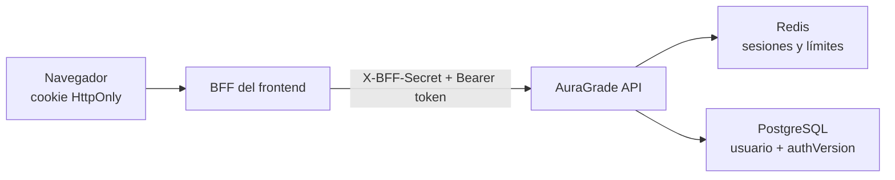

# Plan de integración de sesiones para el frontend

## Objetivo

Mover la autenticación del navegador al patrón BFF: el navegador conserva únicamente una cookie
`HttpOnly`; el servidor del frontend intercambia esa cookie por el token opaco esperado por el
backend. Ningún token de sesión debe quedar disponible para JavaScript, `localStorage`,
`sessionStorage`, Zustand persistido ni respuestas públicas del BFF.



## Contrato confirmado del backend

### Rutas

| Operación | Método y ruta | Autenticación | Respuesta relevante |
| --- | --- | --- | --- |
| Registro | `POST /api/auth/register` | BFF | `{ user, sessionToken, token, expiresAt }` |
| Inicio de sesión | `POST /api/auth/login` | BFF | `{ user, sessionToken, token, expiresAt }` |
| Sesión actual | `GET /api/auth/me` | BFF + Bearer | `{ user }` |
| Cerrar sesión actual | `POST /api/auth/logout` | BFF + Bearer opcional | `{ success: true }` |
| Cerrar todas | `POST /api/auth/logout-all` | BFF + Bearer | `{ success, revokedSessions }` |
| Revocar como administrador | `POST /api/auth/users/:userId/revoke-sessions` | Administrador | `{ success, revokedSessions }` |
| GraphQL | `POST /graphql` | BFF + Bearer cuando aplique | Respuesta GraphQL |
| Salud | `GET /api/health` | Pública | Estado de salud |

`token` es un alias temporal de `sessionToken`. El frontend nuevo debe leer `sessionToken`; el alias
se eliminará después de completar la migración.

### Errores

| Situación | REST | GraphQL | Acción del frontend |
| --- | --- | --- | --- |
| Sesión ausente, inválida o vencida | `401` | `UNAUTHENTICATED` | Limpiar cookie y estado; redirigir a login una sola vez |
| Usuario autenticado sin permiso | `403` | `FORBIDDEN` | Mantener sesión; mostrar vista de acceso denegado |
| Límite excedido | `429` | Código/estado equivalente | Respetar `Retry-After`; no reintentar en bucle |
| Redis o limitador no disponible | `503` | `SERVICE_UNAVAILABLE` | Mostrar indisponibilidad temporal; reintento acotado |

Todas las respuestas incluyen `X-Request-ID`. El BFF debe conservarlo y asociarlo a sus logs. Puede
enviar `X-Request-ID` y `traceparent`; el backend solo confía en esos encabezados cuando
`X-BFF-Secret` es válido.

## Variables del frontend

Variables exclusivamente de servidor:

```env
AURA_GRADE_API_URL=http://backend:3000
AURA_GRADE_BFF_SECRET=<mismo valor que BFF_SHARED_SECRET del backend>
SESSION_COOKIE_NAME=ag_session
```

`AURA_GRADE_BFF_SECRET` y el token opaco nunca deben llevar prefijos públicos como `NEXT_PUBLIC_`,
`VITE_` o equivalentes.

## Fases de implementación

### F0. Inventario y red de seguridad

- Localizar todo acceso a `token`, JWT, `Authorization`, `localStorage` y `sessionStorage`.
- Identificar clientes REST, Apollo/GraphQL, middleware, guards de rutas y stores persistidos.
- Agregar pruebas que describan el comportamiento actual de login, recarga, logout y errores antes
  de reemplazarlo.

Salida: lista de archivos consumidores y una prueba fallando por cada flujo que se va a migrar.

### F1. Cliente privado del backend

- Crear un único cliente ejecutable solo en servidor.
- Añadir siempre `X-BFF-Secret`.
- Leer `ag_session` desde cookies del servidor y añadir `Authorization: Bearer <token>`.
- Propagar `X-Request-ID`, `traceparent`, estado HTTP, `Retry-After` y el cuerpo seguro del error.
- Impedir caché para autenticación con `Cache-Control: no-store`.

Salida: ninguna ruta BFF construye encabezados de autenticación por su cuenta.

### F2. Rutas BFF de autenticación

- Implementar handlers internos para `register`, `login`, `me`, `logout` y `logout-all`.
- En login/registro, extraer `sessionToken`, fijar la cookie y devolver al navegador solo
  `{ user, expiresAt }`.
- Cookie en producción: `HttpOnly`, `Secure`, `SameSite=Lax`, `Path=/`.
- Ajustar `Max-Age` a `expiresAt`; para sesión no recordada puede omitirse `Max-Age` si se desea una
  cookie de navegador, sin extender la expiración que controla el backend.
- En logout, llamar primero al backend y limpiar la cookie aunque la sesión ya sea inválida.

Salida: las respuestas visibles en DevTools no contienen `sessionToken` ni `token`.

### F3. Arranque y estado de sesión

- Reemplazar la decodificación local de JWT por una llamada a `me`.
- Mantener en el store del cliente únicamente usuario, estado de carga y estado de autenticación.
- Deduplicar llamadas simultáneas a `me`.
- No persistir el usuario como prueba de autenticación; después de una recarga, `me` es la fuente de
  verdad.

Salida: recargar la página conserva una sesión válida y elimina correctamente una sesión vencida.

### F4. Proxy REST y GraphQL

- Enviar REST protegido a través del BFF.
- Enviar GraphQL a un proxy BFF que reenvíe hacia `POST /graphql`.
- Eliminar interceptores del navegador que lean o escriban tokens.
- Centralizar la traducción de `401`/`UNAUTHENTICATED`, `403`/`FORBIDDEN`, `429` y `503`.
- Asegurar que una respuesta `FORBIDDEN` no cierre la sesión.

Salida: ninguna solicitud del navegador llega directamente al backend en producción.

### F5. Protección de navegación

- Resolver acceso inicial en middleware o layout de servidor cuando sea viable.
- Evitar dos redirecciones concurrentes cuando varias consultas reciben `401`.
- Preservar una ruta de retorno segura después del login; aceptar solo destinos internos.
- Mostrar una pantalla específica para falta de permisos.

Salida: no hay destellos de contenido privado ni bucles login-dashboard-login.

### F6. Operación administrativa y UX

- Añadir “Cerrar todas las sesiones” para el usuario actual.
- Para administradores, integrar la revocación por `userId` con confirmación explícita.
- Mostrar mensajes diferenciados para credenciales inválidas, límite de intentos e indisponibilidad.
- No registrar contraseñas, cookies, encabezados `Authorization` ni secretos.

Salida: la revocación se refleja en la siguiente petición de cada dispositivo.

### F7. Pruebas

Pruebas unitarias:

- Opciones de cookie en desarrollo y producción.
- Sanitización de respuestas de login/registro.
- Mapeo de errores y redirección única.
- Propagación de `X-Request-ID` sin registrar secretos.

Pruebas de integración:

- Login fija cookie; `me` la utiliza.
- Logout es idempotente y borra cookie.
- Logout-all invalida dos agentes distintos.
- GraphQL distingue `UNAUTHENTICATED` de `FORBIDDEN`.
- `429` respeta `Retry-After`.
- `503` no se presenta como credenciales inválidas.

Pruebas E2E:

- Login, recarga, navegación protegida y logout.
- Cookie invisible para `document.cookie`.
- Ausencia de tokens en almacenamiento y payloads públicos.
- Sesión vencida durante navegación.
- Dos pestañas convergen al mismo estado tras logout.

### F8. Despliegue gradual y retiro de compatibilidad

1. Desplegar backend con sesiones opacas y `AUTH_ACCEPT_LEGACY_JWT=true`.
2. Desplegar el BFF y observar métricas de login, sesiones inválidas, Redis y latencia.
3. Confirmar que el navegador ya no envía JWT ni conserva tokens.
4. Cambiar `AUTH_ACCEPT_LEGACY_JWT=false`.
5. Observar un ciclo completo del TTL legado.
6. Eliminar el alias `token` del backend y cualquier código de compatibilidad del frontend.

## Criterios de aceptación conjunta

- El navegador solo conoce una cookie `HttpOnly`; no conoce el token opaco.
- El backend en producción rechaza solicitudes que no tengan el secreto BFF correcto.
- REST y GraphQL comparten el mismo estado de sesión y el mismo tratamiento de errores.
- Un `403/FORBIDDEN` no destruye una sesión válida.
- Logout y logout-all revocan efectivamente Redis.
- Cambio de contraseña, bloqueo y revocación administrativa invalidan sesiones existentes.
- Se puede rastrear una petición front-BFF-backend mediante `X-Request-ID`.
- Las pruebas unitarias, de integración y E2E pasan antes de desactivar JWT legado.

## Orden sugerido de trabajo

Las fases F1 y F2 forman el primer cambio desplegable. F3 y F4 deben entrar juntas para evitar dos
fuentes de autenticación. F5 y F6 completan la experiencia. F7 es puerta obligatoria para F8.
